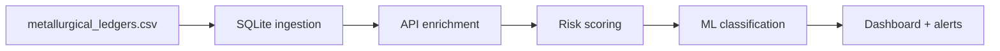

# Corporate Compliance — Financial Risk & Anomaly Detection


A trade-compliance monitoring system that flags TBML (Trade-Based Money Laundering), sanctions evasion, and pricing anomalies in metallurgical commodity transactions.

The pipeline ingests ~15k transaction records, cross-references them against live market data from Yahoo Finance, UN Comtrade, and World Bank APIs, and scores each transaction across six risk dimensions. A Random Forest classifier trained on the scored features achieves 0.9993 ROC-AUC for fraud detection.

---

## What it does

- Pulls live commodity prices (Gold, Silver, Copper, Aluminum) from Yahoo Finance and compares them against invoice prices to catch over/under-invoicing
- Fetches official trade flow data from UN Comtrade to validate whether transaction volumes make sense relative to bilateral trade
- Uses World Bank governance indicators (LPI, GDP, corruption index) to assess country-level risk
- Runs Benford's Law analysis on invoice amounts to detect digit manipulation
- Computes Mahalanobis distance across transaction features to find multivariate outliers
- Cross-references vendor countries against the OFAC SDN sanctions list
- Trains Logistic Regression and Random Forest models on labeled fraud data

## Pipeline



## TBML detection methods

| Method | What it catches | Implementation |
|--------|----------------|----------------|
| Price delta | Over/under-invoicing | Compare unit price vs live spot price |
| Volume anomaly | Ghost shipments, fabricated invoices | Z-score on volume by vendor/commodity |
| Structuring | Smurfing near CTR threshold ($10k) | Proximity analysis on transaction amounts |
| Sanctions screening | OFAC/SDN violations | Country matching against Treasury list |
| Benford's Law | Digit manipulation in invoices | Leading digit frequency vs expected distribution |
| Mahalanobis distance | Multivariate outliers | Chi-squared threshold on 3-feature space |

See [docs/TBML_METHODOLOGY.md](docs/TBML_METHODOLOGY.md) for detailed methodology.

## Risk scoring

Each transaction gets a composite score (0–100) from weighted components:

| Component | Weight |
|-----------|--------|
| OFAC sanctions | 30% |
| Price deviation | 20% |
| Structuring/smurfing | 15% |
| Geopolitical risk | 15% |
| Mahalanobis outlier | 10% |
| Benford's Law | 10% |

Transactions are bucketed into tiers: **CRITICAL** (≥75), **HIGH** (≥50), **MEDIUM** (≥25), **LOW** (<25).

## Model results

| Model | Accuracy | Precision | Recall | F1 | ROC-AUC |
|-------|----------|-----------|--------|----|---------|
| Logistic Regression | 95.61% | 41.78% | 98.95% | 58.75% | 0.9922 |
| Random Forest | 99.33% | 82.61% | 100.00% | 90.48% | 0.9993 |

The LR model was tuned for high recall (catching all fraud cases), which tanks precision. The RF model gets the best of both worlds.

## Project structure

```
├── data/
│   └── metallurgical_ledgers.csv       # raw transaction data (15,030 rows)
├── src/
│   ├── compliance_risk_scorer.py       # main scoring pipeline
│   ├── sql_pipeline.py                 # SQLite ETL + analytical queries
│   ├── regression_model.py             # ML fraud classifiers
│   └── dashboard.py                    # Plotly Dash web dashboard
├── api/
│   ├── comtrade_api.py                 # UN Comtrade trade flows
│   ├── yfinance_api.py                 # Yahoo Finance spot prices
│   └── worldbankapi.py                 # World Bank indicators
├── outputs/                            # scored data, charts, alerts
├── docs/
│   ├── PIPELINE_AND_TIMELINE.md
│   └── TBML_METHODOLOGY.md
├── powerbi/
│   └── README.md                       # PowerBI import guide
├── requirements.txt
└── .gitignore
```

## Setup

```bash
git clone https://github.com/Celestial-Nexus/Corporate_compliance-financial_risk_anomaly_detection.git
cd Corporate_compliance-financial_risk_anomaly_detection

python -m venv venv
source venv/bin/activate

pip install -r requirements.txt
```

## Running

```bash
# 1. SQL pipeline — builds SQLite DB, runs analytical queries
python src/sql_pipeline.py

# 2. Risk scoring — scores all transactions, generates charts
python src/compliance_risk_scorer.py

# 3. ML models — trains classifiers, outputs metrics
python src/regression_model.py

# 4. Dashboard — interactive web UI at http://127.0.0.1:8050
python src/dashboard.py
```

API scripts (optional, need internet):
```bash
python api/yfinance_api.py      # ~5s
python api/worldbankapi.py      # ~10s
python api/comtrade_api.py      # ~3min (rate limited)
```

## Dashboard

The Plotly Dash app at `src/dashboard.py` has 8 panels: TBML heatmap, Benford's chart, Mahalanobis scatter, risk distribution, time series, fraud type breakdown, model metrics, and vendor risk table.

The scored data can also be imported into PowerBI — see [powerbi/README.md](powerbi/README.md) for instructions.

## Sample outputs

- `outputs/mahalanobis_outliers.png` — multivariate outlier scatter
- `outputs/model_metrics.png` — classifier performance comparison
- `outputs/benfords_law.png` — leading digit analysis
- `outputs/feature_importance.png` — RF feature importances
- `outputs/tbml_alerts.csv` — flagged vendor alerts

## License

MIT
