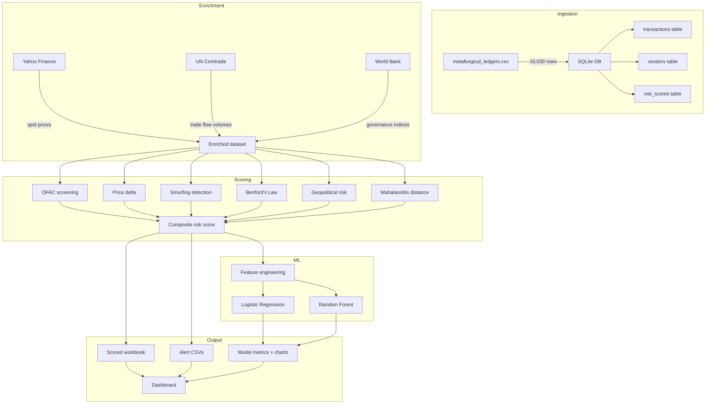

# Project Pipeline & Development Timeline

## Overview

This doc covers the end-to-end data pipeline and the rough 8-week development timeline for the CCFRAD project. The pipeline takes raw metallurgical commodity transactions, enriches them with external data, scores them for compliance risk, and surfaces the results through an interactive dashboard.

## Pipeline architecture

---

## Week-by-week breakdown

### Weeks 1–2: Data ingestion & SQL pipeline

**Goal:** Get the raw data into a queryable format and start pulling external benchmarks.

**What happened:**
- Designed the SQLite schema: `transactions` (main fact table), `vendors` (aggregated stats per vendor), `risk_scores` (output table for composite scores)
- Wrote the CSV-to-SQLite ingestion pipeline — nothing fancy, just `pandas.to_sql` with some cleanup
- Built the first round of analytical queries:
  - TBML vendor risk ranking using CTEs (common table expressions) — groups vendors by country, commodity, then ranks by average price deviation and volume
  - Structuring detection query — finds transactions in the $7,500–$10,000 range (just below CTR reporting threshold)
  - Country risk aggregation with window functions — rolling sums and fraud rates per country
  - Commodity price anomaly detection using z-scores computed in SQL (since SQLite doesn't have STDDEV, had to compute variance manually)
- Started integrating UN Comtrade to get official bilateral trade volumes for HS chapters 71 (precious metals), 74 (copper), 76 (aluminum)

**Files:** `src/sql_pipeline.py`, `api/comtrade_api.py`

**Output:** Working SQLite database, 4 exported alert CSVs, initial Comtrade flow data

---

### Week 3: External data enrichment

**Goal:** Pull in real market data so we can compare invoice prices against reality.

**What happened:**
- Yahoo Finance integration for metal futures:
  - Gold: `GC=F` (COMEX gold futures)
  - Silver: `SI=F` (COMEX silver)
  - Copper: `HG=F` (COMEX copper, needed USD/lb → USD/MT conversion)
  - Aluminum: `ALI=F` (LME aluminum)
- World Bank API for country-level indicators. Pulled 5 indicators per vendor country:
  - Logistics Performance Index (LPI) — lower = higher risk
  - GDP per capita — proxy for economic stability
  - Government Effectiveness (WGI) — governance quality
  - Control of Corruption (WGI) — corruption levels
  - Inflation rate (CPI) — macroeconomic risk
- Built a validation step that compares the ledger's `Market_Spot_Price` column against what Yahoo Finance actually reports. This helps catch cases where the ledger itself has suspicious baseline prices.

**Files:** `api/yfinance_api.py`, `api/worldbankapi.py`

**Output:** Price validation table, country risk indicator dataset, risk bar chart

---

### Weeks 4–5: Risk scoring engine

**Goal:** Build out the core scoring logic — each transaction gets scored on multiple risk dimensions.

**What happened:**
- **OFAC screening:** Downloads the SDN list from U.S. Treasury and parses it (the CSV format is messy — had to handle inconsistent column counts). Cross-references vendor countries against sanctioned jurisdictions. Any match = 100 score.
- **Price delta scoring:** Simple — `abs(invoice_price - spot_price) / spot_price`. Caps at 100. This catches over/under-invoicing directly.
- **Smurfing/structuring detection:** This was trickier. For each vendor, we calculate:
  - Transaction frequency (txns per day)
  - Fraction of transactions in the $7,500–$10,000 band (just-below-CTR)
  - Average transaction size
  - Combined into a weighted score: 50% frequency anomaly + 30% CTR proximity + 20% value pattern
- **Benford's Law:** Extract leading digits from `Total_Value_USD`, compute observed frequency per vendor, compare to expected Benford distribution using mean absolute deviation. High MAD = suspicious.
- Wired all scores into the composite risk engine with the final weights.

**Files:** `src/compliance_risk_scorer.py`

**Output:** Scored workbook with 6 individual risk columns + composite score + risk tier

---

### Week 6: Statistical anomaly detection

**Goal:** Add Mahalanobis distance and finalize the geopolitical risk component.

**What happened:**
- **Mahalanobis distance:** Uses three features — `Volume_MT`, `Unit_Price_USD`, `Total_Value_USD`. Computes the covariance matrix, inverts it (using pseudo-inverse since the matrix can be near-singular), and calculates the Mahalanobis distance for each transaction. Threshold is based on the chi-squared distribution at p=0.975 with 3 degrees of freedom (√9.348 ≈ 3.06).
  - Found 381 outliers (2.5% of transactions)
  - The scatter plot shows these as orange diamonds, with ground-truth fraud overlaid as red X marks
- **Geopolitical risk score:** Combined World Bank indicators with UN Comtrade data. For each country: 40% LPI risk + 40% GDP risk + 20% trade share anomaly. Sanctioned proxy countries automatically get 100.
- Generated the final composite risk score (weighted sum of all 6 dimensions) and assigned risk tiers.

**Files:** `src/compliance_risk_scorer.py`

**Output:** `mahalanobis_outliers.png`, `benfords_law.png`, updated scored workbook

---

### Week 7: Machine learning models

**Goal:** Train supervised classifiers using the labeled fraud data and the risk scores as features.

**What happened:**
- Feature engineering took a while. Final feature set (15 features):
  - Log-transformed value and volume columns (log_Total_Value_USD, log_Volume_MT)
  - Date features: month, day of week, quarter
  - Price deviation percentage
  - Label-encoded categoricals: Commodity, Payment_Method, Vendor_Country
  - All 6 risk scores from the scoring engine
- **Logistic Regression:** Used balanced class weights (fraud is only 3.1% of data). Wrapped in a sklearn Pipeline with StandardScaler. Gets high recall (98.95%) but low precision — flags too many clean transactions.
- **Random Forest:** 200 trees, max depth 8, balanced class weights. Much better — 100% recall with 82.6% precision. ROC-AUC of 0.9993.
- Ran 5-fold stratified cross-validation on both models. RF's CV F1 is 88.91% which is solid.
- Generated confusion matrices, ROC curves, and feature importance charts. Top features: OFAC score, price delta, and geopolitical risk.

**Files:** `src/regression_model.py`

**Output:** `model_metrics.png`, `feature_importance.png`, `confusion_matrix.png`

---

### Week 8: Dashboard & documentation

**Goal:** Build something visual that a compliance team can actually use, and document everything.

**What happened:**
- Built an 8-panel Plotly Dash app with interactive filters (country, commodity, risk tier):
  1. KPI cards — transaction count, total volume, fraud rate, critical count
  2. TBML heatmap — country × commodity risk matrix
  3. Benford's Law bar chart — observed vs expected digit frequencies
  4. Mahalanobis scatter — outliers with fraud overlay
  5. Risk score distribution — histogram with dimension dropdown
  6. Monthly time series — volume and risk trends
  7. Fraud type pie chart
  8. Top-50 vendor risk table with color-coded tiers
- Structured the output data for PowerBI import (wrote the import guide at `powerbi/README.md`)
- Cleaned up the codebase and wrote documentation

**Files:** `src/dashboard.py`, `powerbi/README.md`

**Output:** Interactive dashboard at `http://127.0.0.1:8050`, static HTML export

---

## Future work

- **Real-time streaming:** Move from batch CSV processing to a Kafka-based streaming pipeline for live transaction monitoring
- **Network analysis:** Build a vendor transaction graph and use graph algorithms to find suspicious clusters
- **NLP on trade docs:** OCR + text extraction from bills of lading and letters of credit to cross-reference against transaction records
- **Model serving:** Deploy the trained RF model behind a REST API for real-time scoring
